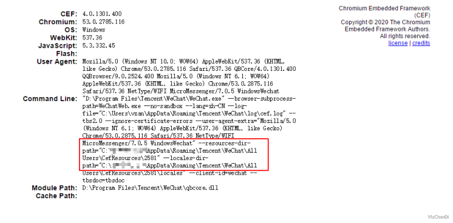
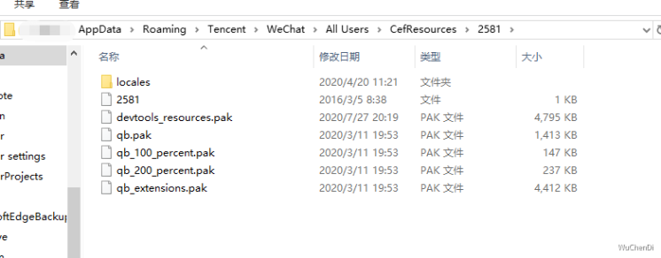
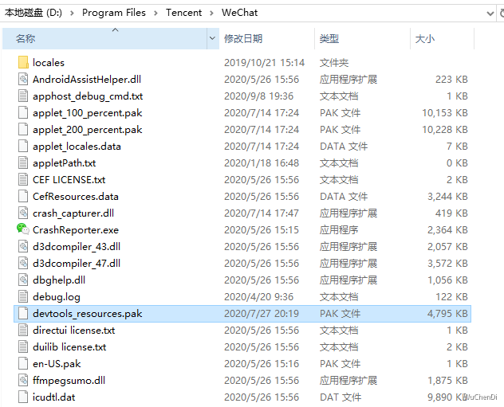
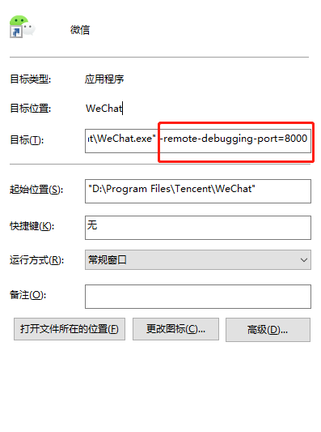

## Windows 桌面版微信内置浏览器打开https://wuchendi.gitee.io/chrome/index.html，如下图所示：

## 下载 devtools_resources.pak 放入 --resources-dir-path 后面路径与微信安装目录中，下载地址在底部，如下图所示

## 微信快捷方式右键选中属性，增加 -remote-debugging-port=8000

## 重启微信,鼠标右击,ShowDevTools
