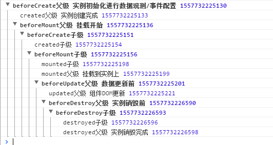
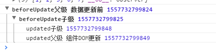

<!--
 * @Date: 2021-05-21 09:25:04
 * @FilePath: \learningNotes\frontInterviewProblem\前端问题回顾.md
-->
## 计算机基础
### UDP 与 TCP 的区别是什么？
**UDP**：是面向无连接的，双方不需要建立连接，并且具有不可靠性，UDP 只是数据的搬运工，不保证数据不丢失且有序的传递到对方，由于 UDP 没有 TCP 那么复杂，所以在传输数据报文时是很高效的，并且传输方式多样，适合在需要实时性很高的场景钟使用，例如：电话会议、直播、王者荣耀等。

**TCP**：TCP 基本是和UDP 反着来，建立连接断开连接都需要先需要进行握手。在传输数据的过程中，通过各种算法保证数据的可靠性，当然带来的问题就是相比 UDP 来说不那么的高效
- 三次握手：三次握手能保证数据可靠传输又能提高传输效率
- 四次挥手：
## Html Css 相关
### 单行居中多行居左布局

**可以使用display: inline-block实现**
```
<!-- html结构 -->
<div class='container'>
  <div class='list'>
    <div class='item'></div>
    <div class='item'></div>
    <div class='item'></div>
    <div class='item'></div>
    <div class='item'></div>
    <div class='item'></div>
    <div class='item'></div>
    <div class='item'></div>
  </div>
</div>

<!-- 样式 -->
.container {
  padding: 10px;
  width: 600px;
  text-align: center;
  border: 1px solid #000;
}
.list {
  display: inline-block;
  text-align: left;
}
.item {
  display: inline-block;
  width: 80px;
  border: 1px solid #f00;
  height: 200px;
}
```
### 如何实现垂直居中布局

**同宽高+padding**
```
.parent{
  width: 100px;
  height: 100px;
  /*将padding设置，来挤出来居中的样子；但是要注意的是，此时的width和height要和子元素的大小一样，否则还是不居中*/
  padding: 100px;
  border: 1px solid;
  margin: 100px auto;
}
.child{
  width: 100px;
  height: 100px;
  background: pink;
  line-height: 100px;
  text-align: center;
}
```
**定位+定宽+定高，使用absolute（定位）**
```
.parent{
  position: relative;
  width: 200px;
  height: 200px;
  border: 1px solid;
}
.child{
  position: absolute;
  width: 100px;
  height: 100px;
  /* 1. 使用 margin:auto ，子元素必须拉满整个容器*/
  width: 200px;
  height: 200px;
  left: 0;
  right: 0;
  top: 0;
  bottom: 0;
  margin: auto;
  /* 2. 通过 calc()函数，值为 50% 减去宽度/高度的一半 */
  left: calc(50% - 150px);
  top: calc(50% - 150px);
  /* 3. 设置该元素的偏移量，值为 50%，并通过外边距 -值 的方式将元素移动回去 */
  left: 50%;
  top: 50%;
  margin-left: -50px;
  margin-top: -50px;
  /* 4. 不知道子元素的宽高，使用transfrom:translate(-50% -50% ) ，CSS3属性有兼容性问题*/
  transform: translate(-50%, -50%);
  background: pink;
  line-height: 100px;
  text-align: center;
}
```
**使用inline-block+table-cell**
```
.parent {
  display: table-cell;
  text-align: center;
  vertical-align: middle;
}
.child {
  display: inline-block;
}
```
**使用flex布局**

只需设置父节点属性，无需设置子元素,兼容性问题
```
.parent {
  display: flex;
  /* 1. 通过 justify-content 以及 align-items: center 实现 */
  justify-content:center;
  align-items:center;
}
.child {
  /* 2. 或者通过 margin auto 实现 */
  margin: auto;
}
```
**使用Grid布局**

只需设置父节点属性，无需设置子元素,兼容性问题
```
.parent {
  display: grid;
  /* 通过 items 属性实现*/
  /* align-items: center; */
  /* justify-items: center; */
  /* items 的缩写 */
  /* place-items: center; */

  /* 或者通过 content 属性 */
  /* align-content: center; */
  /* justify-content: center; */
  /* content 的缩写 */
  /* place-content: center; */
}
.child {
  /* 或者通过 margin auto 实现 */
  /* margin: auto; */
  /* 或者通过 self 属性 */
  /* align-self: center;
  justify-self: center; */
  /* self 的缩写 */
  place-self: center;
}
```
### 浏览器渲染机制、重绘、重排
网页生成过程：HTML被解析生成dom树，css被解析生成cssom树，结合dom和cssom，生成渲染树，生成布局，再绘制。
- 重排（回流）：当dom结构发生变化，需要重新计算页面布局，需要对页面布局重新排列的即是重排，例如增删dom元素，dom元素的尺寸边距宽高等改变。
- 重绘：当元素的外观发生改变，但布局没有变化即是重绘，例如color、background、box-shadow等属性变化。
## JavaScript基础
### JavaScript Event Loop(事件循环)
1. 整体的script(作为第一个宏任务)开始执行的时候，会把所有代码分为两部分：“同步任务”、“异步任务”；
2. 同步任务会直接进入主线程依次执行；
3. 异步任务会再分为宏任务和微任务；
4. 宏任务进入到Event Table中，并在里面注册回调函数，每当指定的事件完成时，Event Table会将这个函数移到Event Queue中；
5. 微任务也会进入到另一个Event Table中，并在里面注册回调函数，每当指定的事件完成时，Event Table会将这个函数移到Event Queue中；
6. 当主线程内的任务执行完毕，主线程为空时，会检查微任务的Event Queue，如果有任务，就全部执行，如果没有就执行下一个宏任务；
7. 上述过程会不断重复，这就是Event Loop事件循环；
### JavaScript 装饰器 - Decorator
装饰器decorator是ES7中的一个提案，目前处于stage-2阶段，装饰器其实就是一个函数，用于描述类、函数、属性、参数，通过@函数名的方式进行调用，它可以放在类和属性的前面。例如：
```
// 创建一个装饰器函数
function log(target) {
  console.log('我是log装饰器函数')
}
// 装饰器调用
@log
class App {}
```
装饰器只是一种语法糖，只是调用方式不一样而已，转换后的代码其实本质上还是下面这样：
```
function log(target) {
  console.log('我是log装饰器函数')
}
var _class = class App {};
let App = log(_class) || _class;
```
装饰是前置执行，例如：类装饰器，会在类被使用前进行调用；函数装饰器会在函数被调用前执行。
### JavaScript常用设计模式
- #### 代理模式
  ```

  ```
- #### 单例模式
- #### 策略模式
- #### 状态模式
- #### 工厂模式
- #### 装饰器模式
  
  装饰器模式的原则：在不改动原来代码逻辑的基础上去添加增量代码。

  假设已有旧代码：
  ```
    window.onload = () => {
    console.log(document.getElementByTagName("*").length); // 8
    };
  ```
  现有需求，需在页面加载完成后打印 '页面加载完毕' 。

  使用装饰器模式来实现：
  ```
    const fn = window.onload;
    window.onload = () => {
      typeof fn === "function" && fn();
      console.log("页面加载完毕");
    };
    // 8
    // 页面加载完毕
  ```
  使用装饰器模式，不会触碰到旧代码，大大降低了 bug 出现的几率。
- #### 适配器模式

  适配器模式主要用来兼容代码。

  假设有一个远古项目，数据请求使用的是 ajax 库。
  ```
    // 发送get请求
    Ajax('get', url地址, post入参, function(data){
        // 成功的回调逻辑
    }, function(error){
        // 失败的回调逻辑
    })
  ```
  现在需求要将数据请求库改为现代请求库 fetch 。

  如果我们在调用了 Ajax 的地方都去修改，那修改、测试成本太高，这时候就可以用到适配器模式。
  ```
    // Ajax适配器函数，入参与旧接口保持一致
    async function AjaxAdapter(type, url, data, success, failed) {
        const type = type.toUpperCase()
        let result
        try {
            // 实际的请求全部由新接口发起
            if(type === 'GET') {
                result = await HttpUtils.get(url) || {}
            } else if(type === 'POST') {
                result = await HttpUtils.post(url, data) || {}
            }
            // 假设请求成功对应的状态码是1
            result.statusCode === 1 && success ? success(result) : failed(result.statusCode)
        } catch(error) {
            // 捕捉网络错误
            if(failed){
                failed(error.statusCode);
            }
        }
    }
    // 用适配器适配旧的Ajax方法
    async function Ajax(type, url, data, success, failed) {
        await AjaxAdapter(type, url, data, success, failed)
    }
  ```
  使用适配器模式：

  1. 要实现一个适配器让原先调用 Ajax 函数的参数能无缝衔接到新的请求库上
  2. 覆盖 Ajax 函数，调用适配器
  这样一来，原本调用 Ajax 函数地方就可以不必需改直接复用。
- #### 观察者模式
  观察者模式，又称发布订阅模式。发布者主要拥有：添加订阅，发布通知功能，订阅者主要有：接受通知，执行命令功能。

  应用场景：
  - Vue.js 的双向绑定
  - Event Bus
  
  观察模式的简单实现：
  ```
    class Publisher {
      constructor() {
        this.observers = [];
      }

      addObserver(observer) {
        this.observers.push(observer);
      }

      publish() {
        this.observers.forEach((item) => {
          item.receive();
        });
      }
    }
    class Observer {
      receive() {
        console.log("收到通知后执行命令");
      }
    }

    const obs = new Observer();
    const publish = new Publisher();

    publish.addObserver(obs);
    publish.publish(); // 收到通知后执行命令
  ```
## Vue
### vue2 双向绑定原理
- #### 双向绑定是什么？
首先明确一下双向绑定和响应式的概念，双向绑定是双向的，表示数据改变驱动视图改变，视图反过来也可以改变数据。响应式是单向的，只代表数据改变驱动视图改变，响应式的主要原理是数据劫持和观察者模式，是 Vue 最核心的模块。
- #### Vue 双向绑定和 React 单向绑定
其中 Vue 和 React 的区别之一就是：Vue 是双向绑定；React 是单向绑定，因为 React 视图的改变需要手动执行 this.$setState() 来改变数据。
- #### Vue2 数据劫持的原理
  数据劫持核心是 defineReactive 函数，里面主要使用 Object.defineProperty 来对对象访问器 getter 和 setter 进行劫持。数据变更时 set 函数里面可以通知视图更新。
  在使用 Object.defineProperty 进行数据劫持的时候，对象和数组是分开处理的：对象是遍历对象属性之后进行递归劫持；数组是重写数组的原型方法比如 splice。这个我看了一些源码和资料。Object.defineProperty 本身是可以监控到数组下标的变化的，但尤大在 github issue 回复过从性能/体验的性价比考虑弃用了这种对数组的劫持方案。举例子就是对象属性通常比较少对每一个属性劫持不会消耗太多性能，但数组可能有成千上万个元素，如果每一个元素都劫持，无疑消耗过多性能。
- #### Vue2 数据劫持的缺陷
  第一个缺陷是由于 Vue2 数据劫持底层是用 ES5 的 Object.defineProperty 实现的，所以不兼容 IE8 以下。
  第二个缺陷是 Vue2 数据劫持无法检测数组和对象的变化，只会劫持一开始存在 data 选项里面的数据，这就是官网建议我们把可能要使用的数据一开始声明在 data 里面并提供初始值。对象新增属性可以通过 Vue.\$set() 进行数据劫持，数组新增元素也可以通过 Vue.$set()，或者因为数组原型方法已经被重写了可以用 splice、push、unshift 等方法新增元素。
- #### Vue3 数据劫持的优势
  Vue3 数据劫持底层主要是使用 ES6 的 Proxy 实现。
  ##### Proxy 的优势如下:
  1. Proxy 可以直接监听对象（const proxy = new Proxy(target, handler)）；defineProperty 需要遍历对象属性进行监听。
  2. Proxy 可以直接监听对象新增的属性；defineProperty 只能劫持一开始就存在的属性，新增属性需要手动 Observer。
  3. Proxy 可以直接监听数组的变化；defineProperty 无法监听数组的变化。
  4. Proxy 有多达 13 种拦截方法：不限于 get、set、has、deleteProperty、apply、ownKeys、construct 等等；除开 get 和 set 其他都是 defineProperty 不具备的。
  5. Proxy 返回的是一个新对象，我们可以只操作新的对象达到目的；defineProperty 只能遍历对象属性直接修改；
  ##### Proxy 的劣势如下:
  1. ES6 的 Proxy 的存在浏览器兼容性问题。
  2. Proxy 和 Reflect 结合实现 Vue3 底层数据劫持原理。Reflect 设计的目的是为了优化 Object 的一些操作方法以及合理的返回 Object 操作返回的结果，对于一些命令式的 Object 行为，Reflect 对象可以将其变为函数式的行为。比如 （'name' in obj） = Reflect.has(obj, 'name')
- #### Vue3 有什么新特性
  Vue2.x 的组织代码形式，叫 Options API，而 Vue3 最大的特点是 Composition API 中文名是合成函数：以函数为载体，将业务相关的逻辑代码抽取到一起，整体打包对外提供相应能力。可以理解它是我们组织代码，解决逻辑复用的一种方案。
  
  其中 setup 是 Composition API 的入口函数，是在 beforeCreate 声明周期函数之前执行的。还提供了 ref 函数定义一个响应式的数据，reactive 函数定义多个数据的响应式等等。
### 函数式组件，函数是组件？
什么是函数式组件？函数式组件就是函数是组件，感觉在玩文字游戏。使用过React的同学，应该不会对函数式组件感到陌生。函数式组件，我们可以理解为没有内部状态，没有生命周期钩子函数，没有this(不需要实例化的组件)。

在日常写bug的过程中，经常会开发一些纯展示性的业务组件，比如一些详情页面，列表界面等，它们有一个共同的特点是只需要将外部传入的数据进行展现，不需要有内部状态，不需要在生命周期钩子函数里面做处理，这时候你就可以考虑使用函数式组件。

先来一个函数式组件的代码
```
export default {
  // 通过配置functional属性指定组件为函数式组件
  functional: true,
  // 组件接收的外部属性
  props: {
    avatar: {
      type: String
    }
  },
  /**
   * 渲染函数
   * @param {*} h
   * @param {*} context 函数式组件没有this, props, slots等都在context上面挂着
   */
  render(h, context) {
    const { props } = context
    if (props.avatar) {
      return </img>
    }
    return </img>
  }
}
```

在上例中，我们定义了一个头像组件，如果外部传入头像，则显示传入的头像，否则显示默认头像。上面的代码中大家看到有一个render函数，这个是Vue使用JSX的写法，关于JSX,小编将在后续文章中会出详细的使用教程。

为什么使用函数式组件
最主要最关键的原因是函数式组件不需要实例化，无状态，没有生命周期，所以渲染性能要好于普通组件
1. 函数式组件结构比较简单，代码结构更清晰
2. 函数式组件与普通组件的区别
3. 函数式组件需要在声明组件是指定functional
4. 函数式组件不需要实例化，所以没有this,this通过render函数的第二个参数来代替
5. 函数式组件没有生命周期钩子函数，不能使用计算属性，watch等等
6. 函数式组件不能通过\$emit对外暴露事件，调用事件只能通过context.listeners.click的方式调用外部传入的事件，因为函数式组件是没有实例化的，所以在外部通过ref去引用组件时，实际引用的是HTMLElement函数式组件的props可以不用显示声明，所以没有在props里面声明的属性都会被自动隐式解析为prop,而普通组件所有未声明的属性都被解析到$attrs里面，并自动挂载到组件根元素上面(可以通过inheritAttrs属性禁止)
我不想用JSX，能用函数式组件吗？在Vue2.5之前，使用函数式组件只能通过JSX的方式，在之后，可以通过模板语法来生命函数式组件
```
<!--在template 上面添加 functional属性-->
<template functional>
  
</template>
<!--根据上一节第六条，可以省略声明props-->
```
### vue中父级与子组件生命周期的先后顺序


从打印我们可以看出来，父级beforeMount挂载开始时才会进入到子级beforeCreate实例化开始，但是子级mounted挂载实例比父级mounted挂载实例要快1毫秒，为什么呢？并且子级初次渲染时没有数据更新，那什么时候子级会数据更新呢？

当父组件执行完beforeMount挂载开始后，会依次执行子组件中的钩子，直到全部子组件mounted挂载到实例上，父组件才会进入mounted钩子

当对子级进行事件处理时，就会触发哦，从下图可以看出，子级进行事件，会先触发父级beforeUpdate钩子，再去触发子级beforeUpdate钩子，下面又是先执行子级updated钩子，后执行父级updated钩子，同理与上相同

## React
## qianku微应用探索
简介：qiankun 是基于 single-spa 封装的，提供了更加开箱即用的 API，使得微应用的接入像使用 iframe 一样简单，实现把应用改造的工作量降到最低。并且主应用和微应用都是技术栈无关的，解决了开发中的两个问题：第一是空间上不同团队的协同开发不必统一技术栈，第二是时间上不同版本技术栈的升级维护无需统一。因此技术栈无关是微前端的核心价值。

#### JS 沙箱：
  - 快照沙箱(snapshotSandbox)：在应用沙箱挂载和卸载的时候记录快照，在应用切换的时候依据快照恢复环境。qiankun 的快照沙箱是基于 diff 来实现的，主要用于不支持 window.Proxy 的低版本浏览器，而且也只适合单个实例的子应用，且会污染全局 window。
  - 代理沙箱(proxySandbox)：qiankun 基于 es6 的 Proxy 实现了两种应用场景不同的沙箱，一种是 legacySandbox(单例)，一种是 proxySandbox(多例)。因为都是基于 Proxy 实现的，所以都称为代理沙箱。
    1. 单例沙箱(legacySandbox)：同样会对 window 造成污染，但是性能比快照沙箱好，不用遍历 window 对象。
    2. 多例沙箱(proxySandbox)：不会污染全局 window 并支持多个子应用同时加载。
  - 样式隔离：微前端框架里面可能会遇到的样式冲突有两种，一种是主子应用样式冲突，另一种是子应用之间的应用冲突。
  - 动态样式表(Dynamic Stylesheet)：qiankun 自动实现子应用切换时子应用样式动态切换，能够保证你在单应用模式下（就是同时只能有一个应用活跃的情况下）保证子应用和子应用之间的样式不会冲突。
  - 工程化手段(css module)：可以通过手动的方式确保主应用与微应用之间的样式隔离，比如给主应用的所有样式添加一个前缀（或者使用库）；也可以通过配置 { sandbox : { experimentalStyleIsolation: true } } 的方式开启运行时的 scoped css 功能，从而解决应用间的样式隔离问题。
  - 严格样式隔离(Shadow DOM)：默认情况下沙箱可以确保单实例场景子应用之间的样式隔离，但是无法确保主应用跟子应用、或者多实例场景的子应用样式隔离。当配置为 { strictStyleIsolation: true } 时表示开启严格的样式隔离模式。这种模式下 qiankun 会为每个微应用的容器包裹上一个 shadow dom 节点，从而确保微应用的样式不会对全局造成影响。（但是使用时还是要适配和考虑特殊情况）
## 综合问题
### Vue 实现动态生成路由（动态生成菜单，根据菜单动态生成路由）
路由需要分成两类，静态路由和动态路由。静态路由是任何菜单权限下都能查看的界面路由；动态路由是根据菜单权限动态生成的路由集合。这里的动态路由与VueRouter的动态路由概念没有任何关系。路由表只返回静态路由，动态路由通过router.addRoutes()去动态注入。
```
// 路由表设置
const constantRouterMap // 静态路由
const asyncRouterMap // 需要动态添加的路由
export default new Router({
  routes: constantRouterMap // 这里只返回静态路由
})
// 使用VueRouter的router.addRoutes(routes: Array<RouteConfig>)方法，动态添加路由。
```
### Vue 实现加载动态组件
kepp-alive
### vue&react组件通信
vue组件通信
1. props / emit  或者   children/parent
2. this.emit()  或者  provide/inject
3. EventBus--(this.$bus)
4. VueX
react组件通信
1. props / emit
2. Context 生产者-消费者模式
3. redux
### iOS和Android中H5页面兼容问题
1. IOS不识别日期
new Date("2018-07-01 08:00:00")在Android下正常显示可以直接进行各种操作转化，而在IOS下为invalid date，获取到的时间戳为NaN,确实有点坑啊，只能识别new Date("2018/07/01 08:00:00")这种的，所以需要转化一下，解决方法为统一增加.replace(/-/g,'/')；
```
new Date("2018-07-01 08:00:00".replace(/-/g,'/'))
```
2. Android滚动条问题

